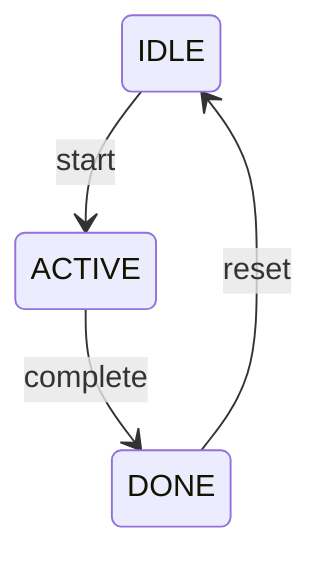
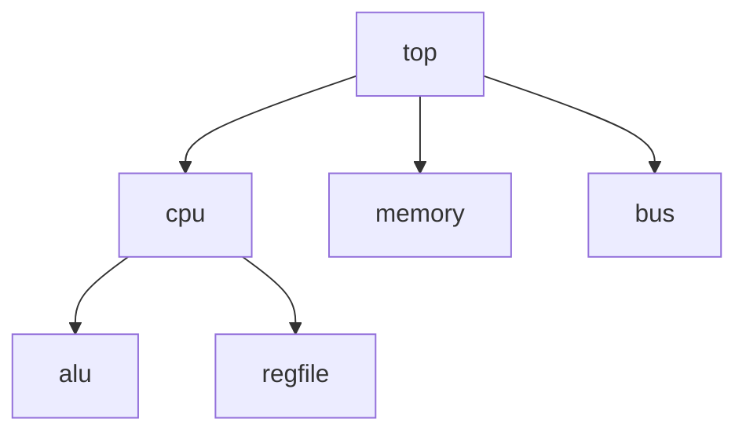

# Future Work - Open WebUI Verilog Tools

This document outlines future development features based on research papers:

- **COMBA-PROMPT** (MCT4SD 2025) - XML-based prompting and debugging framework
- **REFINE-Verilog** (ICICT 2026) - Reliability-focused Verilog generation with SLMs

---

## ✅ Already Implemented

| Feature | Type | File | Status |
| ------- | ---- | ---- | ------ |
| Verilog Syntax Checker (Verilator) | Action | `openwebui_verilator_action.py` | ✅ Done |
| Testbench Generator & Simulator (Icarus) | Action | `openwebui_testbench_action.py` | ✅ Done |
| Schematic Viewer (Yosys) | Action | `openwebui_schematic_action.py` | ✅ Done |
| Verilator Pipeline | Pipeline | `openwebui_verilator_pipe.py` | ✅ Done |

---

## 🚀 Future Work Features

### From COMBA-PROMPT Paper (MCT4SD 2025)

#### 1. XML Prompt Generator

**Type:** Tool/Function
**Priority:** ⭐⭐⭐ High

- Generate structured XML prompts from natural language descriptions
- Enforce constraint validation via Pydantic-XML
- Support for complex logic descriptions with integrity checking

```python
# Example output format
<verilog_request>
  <module_name>counter_8bit</module_name>
  <ports>
    <input name="clk" width="1"/>
    <input name="reset" width="1"/>
    <output name="count" width="8"/>
  </ports>
  <behavior>Increment count on rising edge of clk</behavior>
</verilog_request>
```

---

#### 2. Warning Categorizer

**Type:** Function
**Priority:** ⭐⭐⭐ High

Categorize Verilator warnings for targeted debugging:

| Warning Type | Description | Fix Strategy |
| ------------ | ----------- | ------------ |
| `WIDTHEXPAND` | Bit-width expansion issues | Explicit casting |
| `UNDRIVEN` | Undriven signals | Assign default values |
| `MULTIDRIVEN` | Multiple drivers | Identify conflicting assignments |
| `UNUSEDSIGNAL` | Unused declarations | Remove or comment |
| `UNOPTFLAT` | Suboptimal logic | Refactor combinational logic |

---

#### 3. Topmost Exception Debugging

**Type:** Pipeline
**Priority:** ⭐⭐⭐ High

Implements the core debugging strategy from COMBA-PROMPT:

1. Run synthesis/simulation
2. Parse error output
3. Identify topmost (first) exception
4. Send focused fix request to LLM
5. Repeat until all exceptions resolved

---

#### 4. Exception-Debugging Trial Management

**Type:** Pipeline
**Priority:** ⭐⭐ Medium

- Track multiple debugging trials per session
- Record fix success rates by warning type
- Generate debugging statistics report
- Identify patterns requiring fine-tuning

---

### From REFINE-Verilog Paper (ICICT 2026)

#### 5. Complexity Analyzer

**Type:** Tool
**Priority:** ⭐⭐⭐ High

Use Yosys to analyze design complexity before/after generation:

```bash
yosys -p "read_verilog design.v; synth; stat"
```

**Metrics:**

- Gate count
- Hierarchy depth
- Sequential element count
- Critical path length (with timing analysis)

---

#### 6. Synthesis Feedback Loop

**Type:** Action/Pipeline
**Priority:** ⭐⭐⭐ High

Integrate synthesis results into LLM feedback:

1. Generate Verilog code
2. Run Yosys synthesis
3. Parse synthesis warnings/errors
4. Feed back to LLM for refinement
5. Iterate until synthesis passes

---

#### 7. Multi-Module Generation

**Type:** Pipeline
**Priority:** ⭐⭐ Medium

Support for hierarchical RTL design:

- Staged generation: submodules first, then integration
- Dependency resolution between modules
- Cross-module interface validation

---

#### 8. Timing-Driven Refinement

**Type:** Pipeline
**Priority:** ⭐ Low (Advanced)

Integrate with timing analysis tools:

- Parse timing reports (OpenSTA/Vivado)
- Identify critical paths
- Guide LLM to optimize timing-critical logic

---

## 🛠️ Additional EDA Features

### 9. FSM Visualizer

**Type:** Tool/Action
**Priority:** ⭐⭐⭐ High

Extract and visualize finite state machines:



**Implementation:**

- Parse state declarations and transitions
- Generate Mermaid/DOT diagrams
- Embed in chat response

---

### 10. Module Hierarchy Viewer

**Type:** Tool
**Priority:** ⭐⭐⭐ High

Generate module dependency trees:



---

### 11. Verible Linter Integration

**Type:** Tool
**Priority:** ⭐⭐⭐ High

Style checking with Verible:

```bash
verible-verilog-lint design.v --rules_config=.rules.verible
```

---

### 12. Verible Formatter

**Type:** Action
**Priority:** ⭐⭐ Medium

Auto-format generated Verilog code:

```bash
verible-verilog-format design.v --inplace
```

---

### 13. Auto Documentation Generator

**Type:** Function
**Priority:** ⭐⭐ Medium

Generate documentation from Verilog code:

- Module description
- Port table
- Parameter table
- Timing diagrams (if applicable)

---

## 📋 Implementation Roadmap

### Phase 1: Code Quality (Priority)

- [ ] Warning Categorizer
- [ ] Topmost Exception Debugging
- [ ] Verible Linter Integration

### Phase 2: Visualization

- [ ] FSM Visualizer
- [ ] Module Hierarchy Viewer
- [ ] Enhanced Schematic Viewer

### Phase 3: Documentation

- [ ] Auto Documentation Generator
- [ ] Template-based Docs

### Phase 4: Advanced

- [ ] Multi-Module Generation Pipeline
- [ ] Timing-Driven Refinement
- [ ] Exception Trial Management with Statistics

---

## 📚 References

### COMBA-PROMPT (MCT4SD 2025)

- XML-based prompt structure for Verilog generation
- Topmost Exception Debugging methodology
- Exception-Debugging Trial Management
- Warning categorization: WIDTHEXPAND, UNDRIVEN, MULTIDRIVEN, etc.

### REFINE-Verilog (ICICT 2026)

- Reliability-focused framework for partial Verilog generation
- Synthesis-driven dataset categorization
- Curriculum fine-tuning with complexity metrics
- Iterative inference processing for output validation

---

## 🔧 File Structure (Planned)

```text
vLLM_OpenWebUI/
├── src/
│   └── function/
│       ├── openwebui_verilator_action.py     ✅ Done
│       ├── openwebui_testbench_action.py     ✅ Done
│       ├── openwebui_schematic_action.py     ✅ Done
│       ├── openwebui_verilator_pipe.py       ✅ Done
│       ├── openwebui_warning_categorizer.py  📋 Planned
│       ├── openwebui_verible_lint.py         📋 Planned
│       ├── openwebui_fsm_visualizer.py       📋 Planned
│       ├── openwebui_hierarchy_viewer.py     📋 Planned
│       └── openwebui_doc_generator.py        📋 Planned
├── README.md                                  # User Guide
└── README_FutureWork.md                       # This file
```
